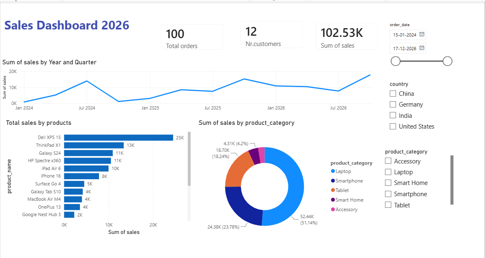

# Sales Performance Dashboard - Power BI

## Project Overview

This project analyses sales performance using Power BI. The dashboard provides insights into sales trends, product performance, customer activity, and category-wise revenue contribution. The goal is to help stakeholders monitor business performance and make data-driven decisions.

## Dashboard Preview

## Tools Used

* Power BI Desktop
* Excel / CSV
* Data Visualisation
* Business Analysis

## Dataset Information

The dataset contains customer information, order details, product categories, and sales data used to analyze business performance.

## Key Performance Indicators (KPIs)

* Total Orders: 100
* Total Customers: 12
* Total Sales: 102.53K

## Dashboard Components

### Sales Trend Analysis

* Sales performance over time.
* Yearly and quarterly trend analysis.

### Product Performance Analysis

* Top-selling products.
* Revenue generated by each product.

### Product Category Analysis

* Revenue contribution by category.
* Category-wise sales distribution.

### Customer Analysis

* Total customers.
* Customer purchasing activity.

### Interactive Filters

* Order Date Filter
* Country Filter
* Product Category Filter

## Key Insights

### Sales Trend

* Sales show an overall upward trend during the analysis period.
* Revenue growth indicates improving business performance.

### Product Performance

* Dell XPS 15 generated the highest sales revenue.
* Google Nest Hub 3 generated the lowest sales revenue.

### Category Analysis

* Laptop category contributes approximately 51% of total revenue.
* Smartphone category is the second-largest revenue contributor.

### Customer Behavior

* 12 customers generated 100 orders.
* Customers placed multiple orders on average, indicating repeat purchasing behavior.

## Business Recommendations

1. Focus marketing efforts on high-performing laptop products.
2. Improve promotional strategies for low-performing products.
3. Expand successful product categories to increase revenue.
4. Monitor customer purchasing trends regularly.

## Skills Demonstrated

* Power BI Dashboard Development
* KPI Creation
* Data Visualization
* Sales Analysis
* Business Intelligence
* Interactive Reporting
* Data Storytelling

## Repository Structure

Sales-Performance-Dashboard-PowerBI/

* Dashboard.pbix
* README.md
* data/

  * customers.csv
  * orders.csv
* images/

  * Dashboard Screenshot
